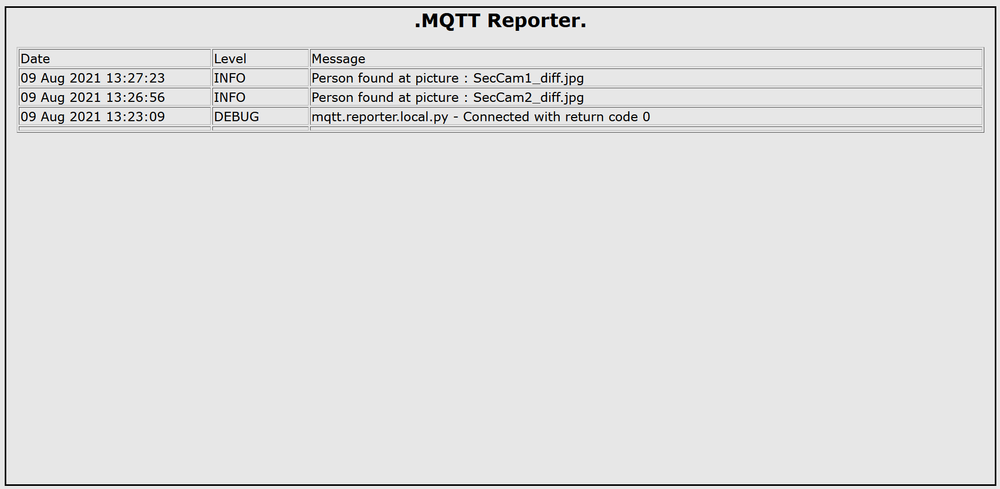

# Playing with AI/ML CNN and WiFi Security cameras   

## The internal camera mechanism to detect movements is very annoying, so I created my own with some improvements   

### I can detect not only movements but people movements. 

### I can keep historical data and send alarms to my mobile so I use it as a security system.  

